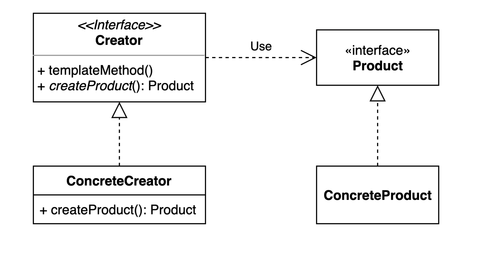

### 팩토리 메소드(Factory method) 패턴

- Product : 새로운 객체를 만들어야되는 객체의 공통점을 가진 인터페이스 (클래스, 팩토리 메서드)
- ConcreteProduct : 새로운 객체 (Product 의 성질을 가진 새로운 객체)
- Creator : 객체(Product)를 만들어내는 Creator 인터페이스 
- ConcreteCreator : Creator 를 구현한 클래스로 새로운 객체(ConcreteProduct)를 만드는 구현 클래스

### 팩토리 메소드(Factory method) 패턴 복습

1. 팩토리 메소드 패턴을 적용했을 때의 장점
   - 객체를 추가적으로 생김으로써 비즈니스 로직이 새로 추가될때 기존코드의 변경이 아닌 해당 객체만 추가를 해도되는 코드가 된다. ( **OCP 가 지켜지는 코드**가 된다. )

2. 팩토리 메소드 패턴을 적용했을 때의 단점
   - 팩토리 메소드 패턴을 적용하면 계층이 늘어나기에 자연스럽게 클래스의 갯수가 늘어날 수 밖에 없다.

3. "확장에 열려있고 변경에 닫혀있는 객체 지향 원칙"을 설명하세요.
   - 객체지향 설계 5원칙(SOLID) 중 하나인 OCP 에 해당하며 풀 네임은 Open-Close Principle 이다. **확장에는 용이하며 변경에는 닫혀있는 원칙으로 원래 코드가 수정되지 않고도 확장**할 수 있게 설계하는 원칙입니다.
   

4. 자바 8에 추가된 default 메소드에 대해 설명하세요.
   - interface 에서도 **기본 구현체**를 만들 수 있게 되었습니다. ( default 메소드가 나옴으로써 현재는 abstract 클래스를 잘 사용하지 않는편이다. )