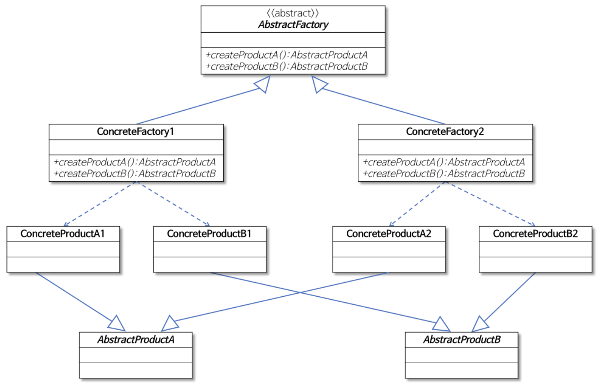

### 추상 팩토리 (Abstract factory) 패턴
**서로 관련이 있는** 여러 객체를 만들어주는 인터페이스

- **구체적으로 어떤 클래스의 인스턴스를(concrete product)** 를 사용하는지 **감출 수 있다**. 
- **객체 생성 처리를 서브 클래스로 분리 해 처리하도록 캡슐화**하는 패턴
- 즉, 객체의 생성 코드를 별도의 클래스/메서드로 분리함으로써 객체 생성의 변화에 대비하는 데 유용하다.
- 특정 기능의 구현은 개별 클래스를 통해 제공되는 것이 바람직한 설계다.
- 상황에 따라 적절한 객체를 생성하는 코드는 자주 중복될 수 있다.
객체 생성 방식의 변화는 해당되는 **모든 코드 부분을 변경해야 하는 문제가 발생**한다.

팩토리 메소드 패턴하고 매우 비슷한 구조이다.    
위 내용을 요약하면서 정리를 하자면,    
추상 팩토리 패턴은 조건에 따른 팩토리가 있어 코드의 변경을 최소화 시킬 수 있고 더욱 캡슐화 할 수 있다는 특징이 있다.   
또한 **구현에 의존적이지 않고 추상에 의존적이여서 구현된 내용을 감출 수 있는( 캡슐화적인 ) 특징**이 드러난다.   

( 잘 모르겠다면 코드를 보면서 이해를 해보자 )

### 추상 팩토리 (Abstract factory) 패턴 복습

- 모양과 효과는 비슷하지만, 둘 다 구체적인 객체 생성 과정을 추상화한 인터페이스를 제공한다.
- 관점이 다르다, 
  - 팩토리 메소드 패턴은 "팩토리를 구현하는 방법(inheritance)"에 초점을 둔다.
  - 추상 팩토리 패턴은 "팩토리를 사용하는 방법(composition)"에 초점을 둔다.
- 목적이 조금 다르다.
  - 팩토리 메소드 패턴은 구체적인 객체 생성 과정을 하위 또는 구체적인 클래스로 옮기는 것이 목적.
  - 추상 팩토리 패턴은 관련있는 여러 객체를 구체적인 클래스에 의존하지 않고 만들 수 있게 해주는 것이 목적.

> 구조
> 

### Reference By.
- https://gmlwjd9405.github.io/2018/08/07/factory-method-pattern.html
- https://gmlwjd9405.github.io/2018/08/08/abstract-factory-pattern.html