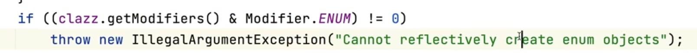

### 싱글톤 (Singleton) 패턴
인스턴스를 오직 한개만 제공하는 클래스

- 시스템 런타임, 환경 세팅에 대한 정보 등, 인스턴스가 여러개 일 때 문제가 생길 수 있는 경우가 있다. 인스턴스를 오직 한개만 만들어 제공하는 클래스가 필요하다.

### 싱글톤 패턴 복습

###1. 자바에서 enum을 사용하지 않고 싱글톤 패턴을 구현하는 방법은?      

싱글톤 패턴을 구현하기위해서 여러가지 방법이 있다.   
- synchronized
- eager
- doubleCheck
- static inner class ( 권장 )

이렇게 있는데 권장되는 방법은 enum 과 static inner class 가 있다.

###2. private 생성자와 static 메소드를 사용하는 방법의 단점은?   
private 생성자와 static 메소드를 사용하는 방법에는 doubleCheck 방법과 static inner class 방법이 있다.   
이 방법의 단점은 리플렉션을 이용하여 조작(싱글톤 패턴을 깨뜨리는 행동)이 가능하다는 단점이 있다.

###3. enum을 사용해 싱글톤 패턴을 구현하는 방법의 장점과 단점은?
enum 의 방법의 장점은 리플렉션으로부터 안전하다.   
왜냐하면 리플렉션은 enum으로 생성자를 만드는 것이 불가능하게 되어있다.

단점은 객체가 생성되어 있어서 무조건 만들어진다는 점이다.

